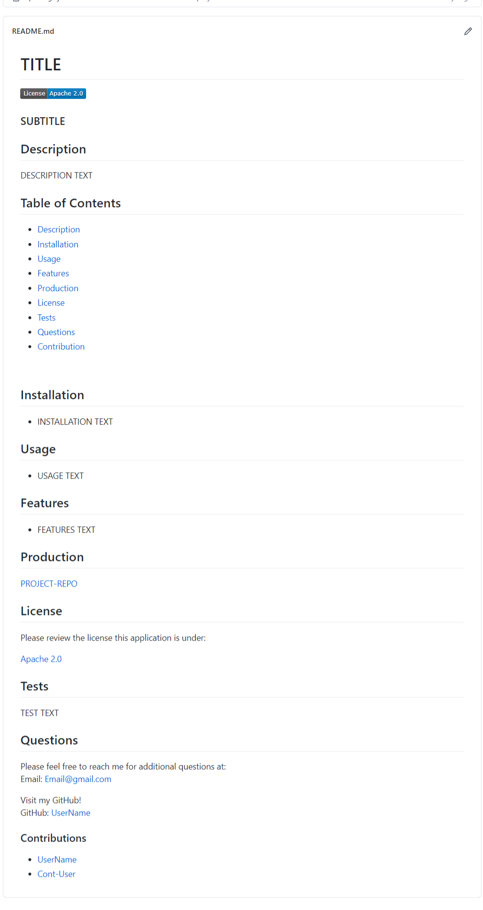

# Professional Readme Generator

### UCT Coding BootCamp Module 9 Challenge

## Description

This application is intended to conditionally generate a professional quality readme with just a few question prompts. Readme-Generator was developed in a GitHub user-friendly manner to streamline the markdown creation process by providing a robust template generated with targeted project data. Template includes title, description, installation, usage and a questions section, with optional additions of a subtitle, features, deployed production, license (including badges), tests and contribution section.

## Table of Contents

- [Description](#Description)
- [Installation](#Installation)
- [Usage](#Usage)
- [Features](#Features)
- [Production](#Production)
- [Questions](#Questions)
- [Contribution](#Contribution)

 

## Installation

- Clone down the application code from GitHub.
- Please ensure you have a node.js integrated terminal before running 'npm inquirer' in the of the root project directory. If not:
- - Download [Node](https://nodejs.org/en/).
- - Inside root directory terminal, run 'npm init'.
- - Inside root directory terminal, run 'npm install inquire' to install [Inquirer](https://www.npmjs.com/package/inquirer#installation).
- Inside root directory terminal, run 'node index.js' to activate application.

## Usage

- Once application is running, user will answer questions by typing in their response into the terminal.
- Questions with '(Required)' will need to be input before the program can proceed.
- When confirming the content in the 'Table of Content' section, this generates a link in this section only.
- - If the user did not confirm a section (ex. Features) from previous question prompts and also selected to include a 'Features' item under the 'Table of Contents', this will render a 'Features' link that will not work as no such section would exist.
- Please review video of application [demo](https://youtu.be/jZtH6FnvjPU).

## Features

- Conditionally generates a "Table of Contents" with links that direct you to specified sections of the README.md.
- Conditionally generates sections of the README.md, depending on the user input.
- GitHub usersnames are generated with a clickable interface that directly connects to their GitHub Repository.
- Application makes a copy of the generated README.md into a 'dist' folder for ease of use.
- License input will render corresponding license link in the "License" section. This will also render corresponding badge under project title in README.md.

## Production

[readme-generator](https://Elysiayn.github.io/readme-generator/)

<!--  -->

## Questions

Please feel free to reach me for additional questions at:
 
Email: Wendy.Lemus.WL@gmail.com

Visit my GitHub!
 
GitHub: [Elysiayn](https://github.com/Elysiayn)

### Contributions

- Modifications by: [Elysiayn](https://github.com/Elysiayn)
- Starter Code provided by: [UCF Coding-Boot-Camp](https://github.com/coding-boot-camp)
