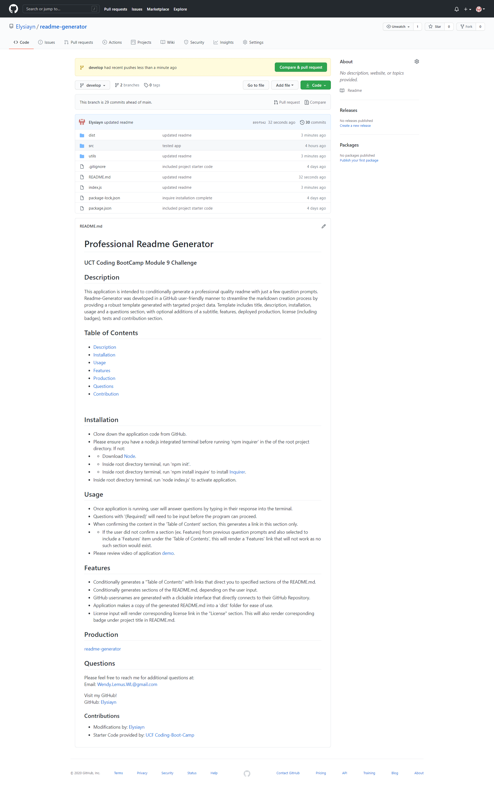

# readme-generator
  ### Challenge 9

  ## Description
  Generates a professional readme

  ## Table of Contents
  * [Installation](#installation)
  * [Usage](#usage)
  * [Features](#features)
  * [Production](#production)
  * [License](#license)
  * [Tests](#tests)
  * [Questions](#questions)
  * [Contributions](#contributions)
  
  ## Installation
  download node

  ## Features
  easy to use

  ## Usage
  open node

  ## Deployed Production
[readme-generator](https://Elysiayn.github.io/readme-generator/)

  ## License
  ha

  ## Tests
  undefined

  ## Questions
  Please feel free to reach me through email at:
  Email: wendy.lemus.wl@gmail.com

  Visit my GitHub!
  GitHub: https://github.com/Elysiayn

  ### Contributions
  undefined
